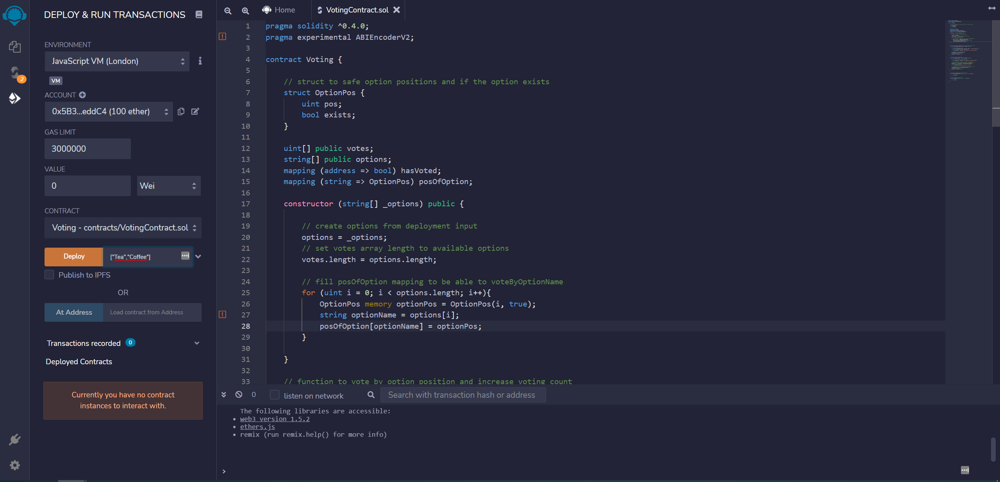

# Ethereum Smart Contract tutorial 🐇

## About

**This Tutorial shows how to write, deploy and interact with a ethereum voting smart contract**

| Key | Value |
| --- | --- |
| `Source Code` | 🕳️ [Pluralsight - Ivan Mushketyk](https://www.pluralsight.com/courses/ethereum-blockchain-developing-applications) |
| `Tutorial Author` | ☕ `Julian Wendland` |
| `$ETH Address` | `0xB345BD9ff34DeFf59526DF03B0A41d5E7C54bC72` |


**1. Download and install MetaMask wallet**

[Download Wallet](https://metamask.io/)

**2. Request Rinkeby testnetwork tokens for transaction fee**

[Rinkeby Faucet](https://faucet.rinkeby.io/)

**3. open Remix - Ethereum Web IDE:**

[Remix Ethereum IDE](https://remix.ethereum.org/)


**4. Create Solidity Smart Contract file VotingContract.sol in Remix IDE**

```solidity

pragma solidity ^0.4.0;
pragma experimental ABIEncoderV2;

contract Voting {

    // struct to safe option positions and if the option exists
    struct OptionPos {
        uint pos;
        bool exists;
    }

    uint[] public votes;
    string[] public options;
    mapping (address => bool) hasVoted;
    mapping (string => OptionPos) posOfOption;

    constructor (string[] _options) public {

        // create options from deployment input 
        options = _options;
        // set votes array length to available options
        votes.length = options.length;

        // fill posOfOption mapping to be able to voteByOptionName
        for (uint i = 0; i < options.length; i++){
            OptionPos memory optionPos = OptionPos(i, true);
            string optionName = options[i];
            posOfOption[optionName] = optionPos;
        }

    }

    // function to vote by option position and increase voting count
    function voteUsingOptionPosition(uint option) public {

        // Check allowed option value
        require(0 <= option && option < options.length,  "Invalid Operation" );
        // Check if an Account has already voted
        require(!hasVoted[msg.sender], "This Address has already voted");

        // increase vote for selected option
        votes[option] = votes[option] +1;
        // set hasVoted to yes
        hasVoted[msg.sender] = true;
    }


    // function to vote by optionName 
    function voteByOptionName (string optionName) public {

        // Check if an Account has already voted
        require(!hasVoted[msg.sender], "This Address has already voted");

        // use mapping to get position of option by optionName
        // Note: using memory instead of storage = cheaper gas fee
        OptionPos memory optionPos = posOfOption[optionName];
        // check if option exists 
        require(optionPos.exists,"Option does not exist"); 

        // increase vote for selected option using optionPos struct
        votes[optionPos.pos] = votes[optionPos.pos] + 1;
        // set hasVoted to yes
        hasVoted[msg.sender] = true;

    }


    // function to read available voting options
    function getVotingOptions() public view returns (string[]) {

        return options;
    }

    // function to get voting counts
    function getVotes() public view returns (uint[]) {

        return votes; 
    }

}

```


**6. Deploy Voting Smart Contract to Ethereum Rinkeby testnetwork using `["Tea","Coffee"]` for `_options` input variable**




**7. Interacting with the public smart contract functions `voteByOptionName` `voteUsingOptionPosition`**

After deploying the smart contract we can call the function `getVotes` to see the initial result is `0,0`.
Next step is to call the function `getVotingOptions` to see `["Tea","Coffee"]` is set.
To vote for Coffee or Tea call the function `voteByOptionName` and choose between `Tea` or `Coffee` for `optionName` string parameter.
Trying to call the function `voteUsingOptionPosition` from the same account leads to the expected errormessage "This Address has already voted"
The last call of function `getVotes` shows as result `1,0` if you voted for `Tea` and `0,1` if you voted for `Coffee`.


